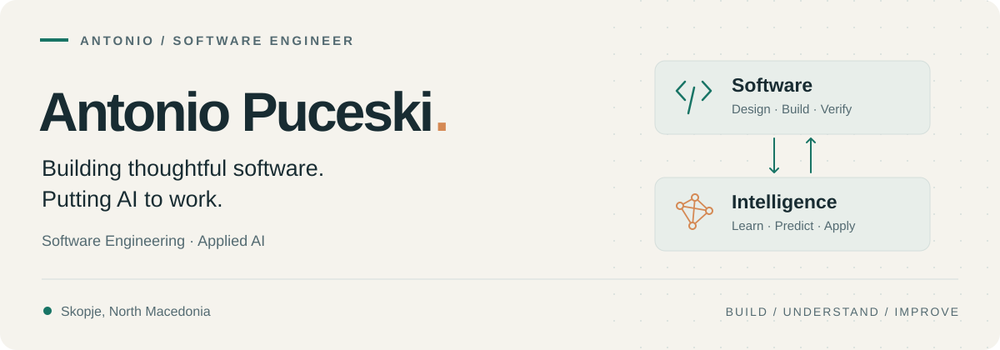

<picture>
  <source media="(prefers-color-scheme: dark)" srcset="./assets/profile-banner-dark.svg">
  <source media="(prefers-color-scheme: light)" srcset="./assets/profile-banner.svg">
  
</picture>

  <a href="https://www.linkedin.com/in/antonio-puceski-9911b1239/"><strong>LinkedIn ↗</strong></a>
  &nbsp;&nbsp; / &nbsp;&nbsp;
  <a href="mailto:puceskia@gmail.com"><strong>Email ↗</strong></a>
  &nbsp;&nbsp; / &nbsp;&nbsp;
  <a href="#selected-work"><strong>Explore my work ↓</strong></a>

## Hi, I'm Antonio.

I'm a software engineering graduate based in **Skopje, North Macedonia**, with professional experience in full-stack development, software integrations, and quality assurance.

I build applications across the stack: **APIs and relational databases, web and mobile interfaces, and applied machine learning.** I enjoy connecting those pieces into something useful—and making the code understandable for whoever works on it next.

**Open to software engineering opportunities and collaboration.** [Let's talk →](mailto:puceskia@gmail.com)

## Selected work

Six projects across product development, data, and interactive experiences.

<table>
<tr>
<td width="50%" valign="top">

01 / FULL-STACK · FITNESS

### [GymTracker ↗](https://github.com/AntonioPuceski/GymTracker)

From planning a workout to tracking progress. A responsive fitness app with exercise discovery, reusable plans, session logging, and body-weight history.

**Under the hood:** ASP.NET Core API, EF Core persistence, PostgreSQL, and WGER exercise synchronization.

<strong>C# · ASP.NET Core · PostgreSQL · JavaScript</strong>

</td>
<td width="50%" valign="top">

02 / FULL-STACK · FINANCE

### [Personal Finance Manager ↗](https://github.com/AntonioPuceski/-personal-finance-manager)

A clearer view of everyday finances. Track income and expenses, filter transactions by date, and explore balances and spending through charts.

**Under the hood:** A React and TypeScript client connected to a Spring Boot REST API and relational data layer.

<strong>Java · Spring Boot · React · TypeScript</strong>

</td>
</tr>
<tr>
<td width="50%" valign="top">

03 / APPLIED ML · NETWORK SECURITY

### [Smart Incident Detection ↗](https://github.com/AntonioPuceski/Smart-Incident-Detection-Dashboard-)

A network-intrusion classification project that takes a model beyond the notebook: enter traffic features and inspect predictions and class probabilities.

**Under the hood:** A trained Random Forest pipeline served through FastAPI, with a React visualization dashboard.

<strong>Python · scikit-learn · FastAPI · React</strong>

</td>
<td width="50%" valign="top">

04 / FRONTEND · COMMERCE

### [Guitar Shop ↗](https://github.com/AntonioPuceski/Guitar-Shop)

A guitar catalog built from a Figma design. Browse brands, filter models, and explore specifications and musicians, with support for three languages.

**Under the hood:** Typed React components, Apollo GraphQL queries, infinite scrolling, and internationalization.

<strong>React · TypeScript · GraphQL · i18next</strong>

</td>
</tr>
<tr>
<td width="50%" valign="top">

05 / COMPUTER VISION · INTERACTION

### [Computer Vision Sensor Hub ↗](https://github.com/AntonioPuceski/Python-camera-sensor-project)

Turning a laptop camera into an input device. An experiment in recognizing hand gestures, facial gestures, and head direction.

**Under the hood:** OpenCV and MediaPipe landmark tracking, gesture counters, event logging, and interactive modes.

<strong>Python · OpenCV · MediaPipe</strong>

</td>
<td width="50%" valign="top">

06 / MOBILE · WEATHER

### [Weather App ↗](https://github.com/AntonioPuceski/WeatherApp)

Current conditions and a five-day forecast in a cross-platform app. Search by city, switch units, and see backgrounds change with the weather.

**Under the hood:** React Native and Expo, typed API requests, and OpenWeather current-weather and forecast data.

<strong>React Native · Expo · TypeScript · REST APIs</strong>

</td>
</tr>
</table>

## Tools I work with

| Area | Technologies |
| :--- | :--- |
| **Backend & APIs** | C# · .NET / ASP.NET Core · Java · Spring Boot · EF Core · JPA |
| **Web & mobile** | TypeScript · JavaScript · React · Angular · Vue.js · React Native |
| **Databases** | PostgreSQL · SQL Server · MySQL · H2 |
| **Python & applied AI** | Python · pandas · scikit-learn · FastAPI · OpenCV · MediaPipe |
| **Development & delivery** | Git · Docker · Swagger / OpenAPI · Jira |

## What matters to me

**Clear boundaries.** Keep APIs, data models, and interfaces understandable.

**Practical verification.** Check behavior, explain limitations, and document how to run the project.

**Useful details.** Treat loading states, error handling, and documentation as part of the product.

---

  <strong>Have a role, a project, or an idea in mind?</strong> 
  <a href="mailto:puceskia@gmail.com">puceskia@gmail.com</a>
  &nbsp;·&nbsp;
  <a href="https://www.linkedin.com/in/antonio-puceski-9911b1239/">Connect on LinkedIn ↗</a>

